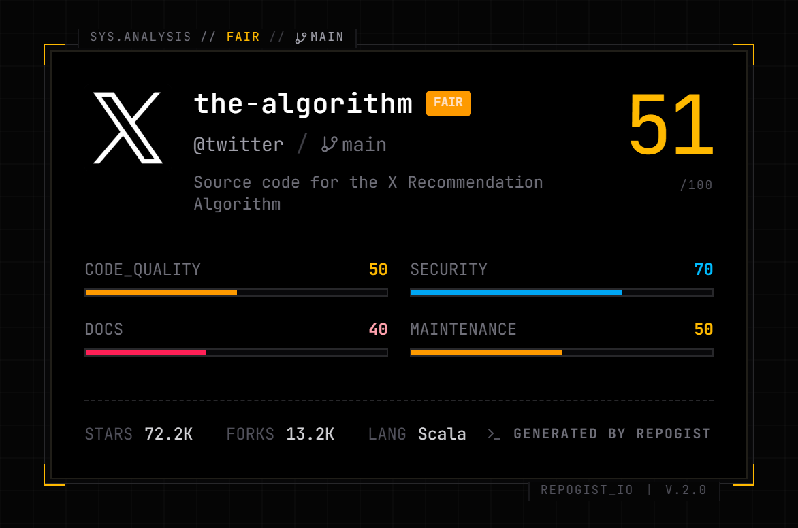
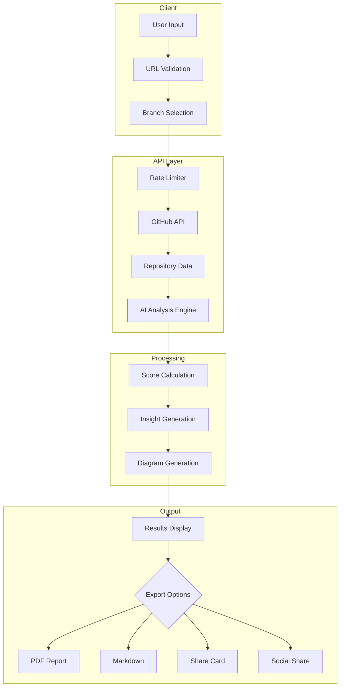

<div align="center">
  
  
  # 
  ### Understand Any Codebase in Seconds
  
  AI insights on your GitHub repo - understand quality, design, security, and improvement opportunities in seconds.

  **Now owned and maintained by Ossium**

[](https://repolyze.ossium.live)
[](https://github.com/OssiumOfficial/Repolyze)
[](./LICENSE)
[](./CODE_OF_CONDUCT.md)
[](https://www.buymeacoffee.com/manixh)

  <br />

[Features](#-features) • [Quick Start](#-quick-start) • [API Reference](#-api-reference) • [Contributing](#-contributing) • [Code of Conduct](./CODE_OF_CONDUCT.md) • [License](#-license)

  <br />


---

### 🔹 Data Flow Diagram


---

### 🔹 PDF Export


---

### 🔹 Repository Score & Insights


--- 

### 🔹 Repository Score Image



</div>

---

## About

**Repolyze** is an open-source tool that leverages AI to analyze GitHub repositories instantly. Whether you're evaluating a new library, onboarding to a codebase, or auditing your own project, Repolyze provides comprehensive insights in seconds.

### Why Repolyze?

| Benefit                | Description                                         |
| ---------------------- | --------------------------------------------------- |
| **Save Hours**         | Understand any codebase in seconds, not hours       |
| **AI-Powered**         | Intelligent analysis using advanced language models |
| **Comprehensive**      | Code quality, security, architecture, and more      |
| **Branch Support**     | Analyze any branch, not just the default            |
| **Beautiful UI**       | Modern, responsive interface with dark mode         |
| **Privacy First**      | No code is stored; analysis happens in real-time    |
| **Free & Open Source** | MIT licensed, community-driven                      |

---

## Features

### Core Analysis

| Feature                   | Description                                             |
| ------------------------- | ------------------------------------------------------- |
| **Health Scoring**        | Comprehensive score (0-100) for overall code quality    |
| **Architecture Analysis** | Visualize component relationships and structure         |
| **Security Insights**     | Identify potential vulnerabilities and security issues  |
| **Dependency Analysis**   | Understand package dependencies and outdated packages   |
| **Tech Stack Detection**  | Automatically identify frameworks and technologies      |
| **AI Recommendations**    | Get actionable improvement suggestions                  |
| **Branch Analysis**       | Analyze any branch in the repository                    |
| **Data Flow Diagrams**    | Interactive Mermaid diagrams showing data flow patterns |

### Export & Sharing

| Feature             | Description                                  |
| ------------------- | -------------------------------------------- |
| **Copy Plain Text** | Copy analysis report as formatted plain text |
| **Copy Markdown**   | Copy full report in Markdown format          |
| **Download PDF**    | Export detailed PDF report with all insights |
| **Share Cards**     | Download beautiful share cards as images     |
| **Social Sharing**  | Share on Twitter, LinkedIn, or copy link     |

### User Experience

| Feature                   | Description                                        |
| ------------------------- | -------------------------------------------------- |
| **Interactive File Tree** | Explore repository structure with file statistics  |
| **Real-time Progress**    | Watch the analysis happen live with status updates |
| **Dark/Light Mode**       | Beautiful themes for any preference                |
| **Fully Responsive**      | Works seamlessly on desktop, tablet, and mobile    |
| **Lightning Fast**        | Built with Next.js 16 for optimal performance      |
| **Smart Caching**         | Recently analyzed repos load instantly             |

---

## Quick Start

### Prerequisites

- **Node.js** 18.0 or higher
- **pnpm** (recommended) or npm/yarn
- **Git**

```bash
# Verify Node.js version
node --version  # Should be >= 18.0.0

# Install pnpm if needed
npm install -g pnpm
```

### Installation

```bash
# 1. Clone the repository
git clone https://github.com/OssiumOfficial/Repolyze.git
cd Repolyze

# 2. Install dependencies
pnpm install

# 3. Set up environment variables
cp .env.example .env.local

# 4. Add your API keys (see Environment Variables section)

# 5. Start development server
pnpm dev

# 6. Open http://localhost:3000
```

### Environment Variables

Create a `.env.local` file with the following:

```env
# ===========================================
# REQUIRED
# ===========================================

# GitHub Personal Access Token
# Get yours at: https://github.com/settings/tokens
# Required scopes: repo, read:user
GITHUB_TOKEN=ghp_xxxxxxxxxxxxxxxxxxxx

# OpenRouter API Key
# Get yours at: https://openrouter.ai/keys
OPENROUTER_API_KEY=sk-or-xxxxxxxxxxxxxxxxxxxx

# ===========================================
# OPTIONAL
# ===========================================

# Site URL (for SEO and social sharing)
NEXT_PUBLIC_SITE_URL=http://localhost:3000

# Cache duration in seconds (default: 3600)
CACHE_TTL=3600
```

<details>
<summary><b>📋 How to Get API Keys</b></summary>

#### GitHub Personal Access Token

1. Go to **GitHub Settings** → **Developer settings** → **Personal access tokens** → **Tokens (classic)**
2. Click **"Generate new token (classic)"**
3. Select scopes: `repo`, `read:user`
4. Copy the token and add it to `.env.local`

#### OpenRouter API Key

1. Go to [OpenRouter](https://openrouter.ai/)
2. Sign up and navigate to **Settings** → **API Keys**
3. Create a new key and add it to `.env.local`

</details>

---

## 🛠️ Tech Stack

| Category       | Technologies                       |
| -------------- | ---------------------------------- |
| **Framework**  | Next.js 16, React 19, TypeScript 5 |
| **Styling**    | Tailwind CSS 4, shadcn/ui          |
| **Animation**  | Framer Motion                      |
| **Diagrams**   | Mermaid                            |
| **PDF Export** | jsPDF                              |
| **AI**         | OpenRouter                         |
| **Deployment** | Vercel                             |

---

## 📁 Project Structure

```
Repolyze/
├── app/
│   ├── api/
│   │   ├── analyze/
│   │   │   ├── route.ts              # POST /api/analyze - Main analysis endpoint
│   │   │   ├── config.ts             # API configuration & constants
│   │   │   ├── types.ts              # Request/Response type definitions
│   │   │   ├── validators.ts         # Input validation schemas
│   │   │   ├── rate-limit.ts         # Rate limiting middleware
│   │   │   └── stream-handler.ts     # SSE streaming handler
│   │   └── branches/
│   │       └── route.ts              # GET /api/branches - Fetch repo branches
│   ├── share/
│   │   └── page.tsx                  # Shareable analysis page
│   ├── layout.tsx                    # Root layout with providers
│   ├── page.tsx                      # Home page
│   └── globals.css                   # Global styles & Tailwind imports
│
├── components/
│   ├── ui/                           # shadcn/ui components (button, card, dialog, etc.)
│   │
│   ├── repo-analyzer/
│   │   ├── index.tsx                 # Main analyzer orchestrator
│   │   ├── section-header.tsx        # Reusable section headers
│   │   └── automations.ts            # Automation suggestions logic
│   │
│   ├── analysis-header/
│   │   ├── index.tsx                 # Analysis results header
│   │   ├── branch-selector.tsx       # Branch selection dropdown
│   │   └── summary-actions.tsx       # Export & share action buttons
│   │
│   ├── file-tree/
│   │   ├── index.tsx                 # File tree container
│   │   ├── tree-node.tsx             # Individual tree node component
│   │   ├── language-tags.tsx         # Language indicator badges
│   │   └── types.ts                  # File tree type definitions
│   │
│   ├── share-card/
│   │   ├── index.tsx                 # Share card generator
│   │   ├── variants/                 # Card variants (compact, default, detailed)
│   │   ├── technical-frame.tsx       # Technical info frame
│   │   └── types.ts                  # Share card types
│   │
│   ├── share-modal/
│   │   ├── index.tsx                 # Share modal entry point
│   │   ├── desktop-dialog.tsx        # Desktop share dialog
│   │   ├── mobile-drawer.tsx         # Mobile share drawer
│   │   └── action-sections.tsx       # Share action buttons
│   │
│   ├── testimonial/
│   │   ├── masonry.tsx               # Masonry layout for testimonials
│   │   ├── testimonial.tsx           # Individual testimonial card
│   │   └── data.ts                   # Testimonial data
│   │
│   ├── ai-insights.tsx               # AI-generated insights display
│   ├── automation-panel.tsx          # Automation suggestions panel
│   ├── architecture-diagram.tsx      # Architecture visualization
│   └── data-flow-diagram.tsx         # Mermaid data flow diagram
│
├── context/
│   ├── analysis-context.tsx          # Global analysis state management
│   └── theme-provider.tsx            # Theme context (dark/light mode)
│
├── lib/
│   ├── pdf-export.ts                 # PDF generation with jsPDF
│   ├── share.ts                      # Share URL & social sharing utilities
│   ├── storage.ts                    # LocalStorage helpers for caching
│   ├── validators.ts                 # URL & input validation functions
│   └── mermaid.ts                    # Mermaid diagram configuration
│
├── public/
│   ├── icon.svg                      # App icon
│   ├── og-image.png                  # Open Graph image for social sharing
│   └── Repolyze-showcase.png        # README showcase image
│
├── .env.example                      # Environment variables template
├── .env.local                        # Local environment variables (git-ignored)
├── next.config.ts                    # Next.js configuration
├── tailwind.config.ts                # Tailwind CSS configuration
├── tsconfig.json                     # TypeScript configuration
└── package.json                      # Dependencies & scripts
```

---

## 🔄 Data Flow



### Component Interaction Flow

```
┌─────────────────┐     ┌──────────────────┐     ┌─────────────────┐
│  RepoAnalyzer   │────▶│ AnalysisContext  │────▶│   API Routes    │
│   (UI Entry)    │     │  (State Mgmt)    │     │  (/api/analyze) │
└─────────────────┘     └──────────────────┘     └─────────────────┘
         │                       │                        │
         ▼                       ▼                        ▼
┌─────────────────┐     ┌──────────────────┐     ┌─────────────────┐
│  AnalysisHeader │     │   File Tree      │     │  GitHub + AI    │
│  (Actions/Nav)  │     │  (Structure)     │     │  (Data Fetch)   │
└─────────────────┘     └──────────────────┘     └─────────────────┘
         │                       │                        │
         ▼                       ▼                        ▼
┌─────────────────┐     ┌──────────────────┐     ┌─────────────────┐
│   ShareModal    │     │   AI Insights    │     │  Score Cards    │
│  (Export/Share) │     │ (Recommendations)│     │  (Metrics)      │
└─────────────────┘     └──────────────────┘     └─────────────────┘
```

---

## 🔌 API Reference

### Analyze Repository

Analyzes a GitHub repository and returns comprehensive insights.

```http
POST /api/analyze
Content-Type: application/json
```

#### Request Body

```json
{
  "repoUrl": "https://github.com/owner/repo",
  "branch": "main",
  "forceRefresh": false
}
```

| Parameter      | Type    | Required | Description                                              |
| -------------- | ------- | -------- | -------------------------------------------------------- |
| `repoUrl`      | string  | Yes      | Full GitHub repository URL                               |
| `branch`       | string  | No       | Branch to analyze (default: repository's default branch) |
| `forceRefresh` | boolean | No       | Skip cache and force re-analysis                         |

#### Response

```json
{
  "success": true,
  "cached": false,
  "data": {
    "metadata": {
      "name": "next.js",
      "fullName": "vercel/next.js",
      "description": "The React Framework",
      "stars": 120000,
      "forks": 25000,
      "language": "TypeScript",
      "branch": "main",
      "license": "MIT",
      "owner": {
        "login": "vercel",
        "avatarUrl": "https://avatars.githubusercontent.com/u/..."
      }
    },
    "scores": {
      "overall": 92,
      "codeQuality": 95,
      "documentation": 90,
      "security": 88,
      "maintainability": 94,
      "testCoverage": 85,
      "dependencies": 90
    },
    "insights": [
      {
        "type": "strength",
        "title": "Excellent Documentation",
        "description": "Comprehensive README and API documentation",
        "priority": "high"
      }
    ],
    "techStack": ["TypeScript", "React", "Next.js", "Turbopack"],
    "fileTree": { "...": "..." },
    "dataFlow": {
      "mermaid": "flowchart TD\n  A[Input] --> B[Process]"
    },
    "refactors": [...],
    "automations": [...],
    "summary": "Next.js is a well-maintained React framework..."
  }
}
```

#### Error Responses

| Status | Code               | Description                |
| ------ | ------------------ | -------------------------- |
| 400    | `INVALID_URL`      | Invalid GitHub URL format  |
| 404    | `REPO_NOT_FOUND`   | Repository not found       |
| 422    | `BRANCH_NOT_FOUND` | Specified branch not found |
| 429    | `RATE_LIMITED`     | Too many requests          |

---

### Get Branches

Fetches all available branches for a repository.

```http
GET /api/branches?repo=owner/repo
```

#### Response

```json
{
  "success": true,
  "data": {
    "branches": [
      { "name": "main", "protected": true, "default": true },
      { "name": "develop", "protected": false, "default": false }
    ],
    "defaultBranch": "main"
  }
}
```

---

### Usage Examples

**cURL:**

```bash
curl -X POST https://repolyze.ossium.live/api/analyze \
  -H "Content-Type: application/json" \
  -d '{"repoUrl": "https://github.com/vercel/next.js", "branch": "canary"}'
```

**JavaScript:**

```javascript
const response = await fetch("/api/analyze", {
  method: "POST",
  headers: { "Content-Type": "application/json" },
  body: JSON.stringify({
    repoUrl: "https://github.com/vercel/next.js",
    branch: "canary",
  }),
});

const { data } = await response.json();
console.log(data.scores.overall); // 92
```

---

## 🧪 Development

### Available Scripts

| Command           | Description               |
| ----------------- | ------------------------- |
| `pnpm dev`        | Start development server  |
| `pnpm build`      | Build for production      |
| `pnpm start`      | Start production server   |
| `pnpm lint`       | Run ESLint                |
| `pnpm lint:fix`   | Fix ESLint errors         |
| `pnpm type-check` | Run TypeScript checks     |
| `pnpm format`     | Format code with Prettier |

### Testing Locally

```bash
# Test analyze endpoint
curl -X POST http://localhost:3000/api/analyze \
  -H "Content-Type: application/json" \
  -d '{"repoUrl": "https://github.com/ig-imanish/mx-icons"}'

# Test branches endpoint
curl "http://localhost:3000/api/branches?repo=ig-imanish/mx-icons"

# Test share page
open http://localhost:3000/share/ig-imanish/mx-icons
```

---

## 🤝 Contributing

We welcome contributions from everyone! Here's how you can help:

### Ways to Contribute

| Type                    | Description                                                                                               |
| ----------------------- | --------------------------------------------------------------------------------------------------------- |
| 🐛 **Bug Reports**      | Found a bug? [Open an issue](https://github.com/OssiumOfficial/Repolyze/issues/new?template=bug_report.md)    |
| 💡 **Feature Requests** | Have an idea? [Start a discussion](https://github.com/OssiumOfficial/Repolyze/discussions/new?category=ideas) |
| 📝 **Documentation**    | Help improve our docs                                                                                     |
| 🔧 **Code**             | Submit bug fixes or new features                                                                          |
| 🎨 **Design**           | Improve UI/UX                                                                                             |

### Getting Started

```bash
# 1. Fork the repository on GitHub

# 2. Clone your fork
git clone https://github.com/YOUR_USERNAME/Repolyze.git
cd Repolyze

# 3. Add upstream remote
git remote add upstream https://github.com/OssiumOfficial/Repolyze.git

# 4. Create a feature branch
git checkout -b feature/amazing-feature

# 5. Install dependencies
pnpm install

# 6. Start development
pnpm dev

# 7. Make your changes and commit
git add .
git commit -m "feat: add amazing feature"

# 8. Push to your fork
git push origin feature/amazing-feature

# 9. Open a Pull Request on GitHub
```

### Commit Convention

We follow [Conventional Commits](https://www.conventionalcommits.org/):

| Type       | Description      | Example                         |
| ---------- | ---------------- | ------------------------------- |
| `feat`     | New feature      | `feat: add branch comparison`   |
| `fix`      | Bug fix          | `fix: resolve memory leak`      |
| `docs`     | Documentation    | `docs: update API reference`    |
| `style`    | Formatting       | `style: fix indentation`        |
| `refactor` | Code refactoring | `refactor: simplify auth logic` |
| `perf`     | Performance      | `perf: optimize image loading`  |
| `test`     | Tests            | `test: add unit tests`          |
| `chore`    | Maintenance      | `chore: update dependencies`    |

### Pull Request Guidelines

Before submitting a PR, please ensure:

- [ ] Code follows the existing style
- [ ] All tests pass (`pnpm lint && pnpm type-check`)
- [ ] Commit messages follow convention
- [ ] Documentation is updated if needed
- [ ] PR description explains the changes

### Issue Guidelines

When opening an issue, please include:

**For Bug Reports:**

- Clear description of the bug
- Steps to reproduce
- Expected vs actual behavior
- Screenshots if applicable
- Environment details (OS, browser, Node version)

**For Feature Requests:**

- Clear description of the feature
- Use case / problem it solves
- Proposed solution (if any)
- Alternatives considered

---

## 🗺️ Roadmap

### Upcoming Features

- [ ] 🔐 Private repository support with OAuth
- [ ] 📊 Historical tracking & score trends
- [ ] 🔔 Webhook notifications on score changes
- [ ] 📈 Team dashboard for multiple repos
- [ ] 🤖 GitHub Action integration
- [ ] 🔍 Branch comparison (side-by-side)

### Recently Completed

- [x] ✅ Branch analysis support
- [x] ✅ Data flow diagrams (Mermaid)
- [x] ✅ PDF export with jsPDF
- [x] ✅ Markdown/Plain text copy
- [x] ✅ Social sharing
- [x] ✅ Dark/Light mode
- [x] ✅ Smart caching

---

## ❓ FAQ

<details>
<summary><b>Is Repolyze free to use?</b></summary>

Yes! Repolyze is completely free and open source under the MIT license.

</details>

<details>
<summary><b>Is my code stored anywhere?</b></summary>

No. Repolyze analyzes repositories in real-time and does not store any code. Only analysis results are temporarily cached.

</details>

<details>
<summary><b>Can I analyze private repositories?</b></summary>

Currently, only public repositories are supported. Private repository support is on our roadmap.

</details>

<details>
<summary><b>What languages are supported?</b></summary>

Repolyze can analyze repositories in any programming language including JavaScript, TypeScript, Python, Go, Rust, Java, and more.

</details>

<details>
<summary><b>How accurate is the analysis?</b></summary>

Repolyze uses advanced AI models for analysis. Results should be considered as helpful suggestions rather than absolute assessments.

</details>

---

## 📝 License

This project is licensed under the **MIT License** - see the [LICENSE](LICENSE) file for details.

```
MIT License

Copyright (c) 2024 Ossium

Permission is hereby granted, free of charge, to any person obtaining a copy
of this software and associated documentation files (the "Software"), to deal
in the Software without restriction, including without limitation the rights
to use, copy, modify, merge, publish, distribute, sublicense, and/or sell
copies of the Software...
```

---

## 🙏 Acknowledgments

Special thanks to these amazing projects:

- [Next.js](https://nextjs.org/) - The React framework
- [shadcn/ui](https://ui.shadcn.com/) - UI components
- [Tailwind CSS](https://tailwindcss.com/) - Styling
- [Framer Motion](https://www.framer.com/motion/) - Animations
- [Mermaid](https://mermaid.js.org/) - Diagrams
- [jsPDF](https://github.com/parallax/jsPDF) - PDF generation
- [OpenRouter](https://openrouter.ai/) - AI gateway
- [Vercel](https://vercel.com/) - Deployment

---

<div align="center">

### ⭐ Show Your Support

If you find Repolyze useful, please consider giving it a star!

[](https://github.com/OssiumOfficial/Repolyze)

**Share with others:**

[](https://twitter.com/intent/tweet?text=Check%20out%20Repolyze%20-%20AI-powered%20GitHub%20repo%20analyzer!&url=https://repolyze.ossium.live)
[](https://www.linkedin.com/sharing/share-offsite/?url=https://repolyze.ossium.live)

</div>
